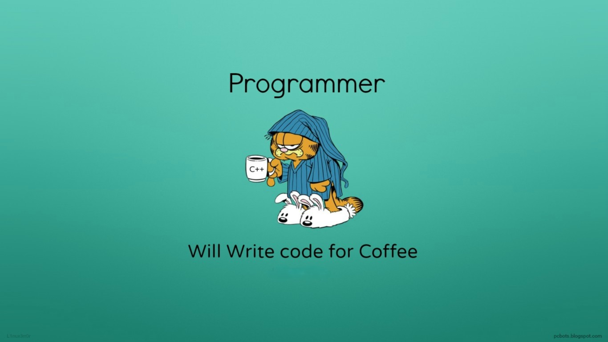

# 💻 Elquin Milthon Aguilar Quiñones

## 🚀 Sobre mí  
Soy un apasionado desarrollador de software con experiencia en **Java, Kotlin, PHP** y bases de datos relacionales y no relacionales (**MySQL, Firebase, MongoDB, Sybase**). Actualmente, curso el décimo ciclo de Ingeniería de Sistemas e Informática en la **Universidad Nacional Santa**. Me especializo en desarrollo móvil, backend y seguridad informática.

---

## 🛠️ Habilidades técnicas  
- **Lenguajes de programación:** Java, Kotlin, PHP  
- **Bases de datos:** MySQL, Firebase, MongoDB, Sybase  
- **Seguridad y redes:** Gestión de riesgos, CCNA, OSINT  
- **Desarrollo móvil:** Kotlin (Jetpack Compose), Android con Firebase  
- **Cloud & DevOps:** Docker, Firebase, GitHub Actions  
- **Herramientas de análisis:** Power BI  

---

## 📜 Certificaciones y Cursos  
- **CCNAv7 - Conceptos Básicos de Redes** | Cisco Networking Academy  
- **CCNAv7 - Introducción a la Ciberseguridad** | Cisco Networking Academy  
- **CCNAv7 - Administración de Amenazas Cibernéticas** | Cisco Networking Academy  
- **Ciberseguridad de Google** | Google / Coursera  
- **CCNAv7 - Dispositivos de Red y Configuración Inicial** | Cisco Networking Academy  

---

## 👨‍💻 Experiencia  
### 📍 **Centro de Salud Conchucos**  
- **Cargo:** Practicante en el área de informática  
- **Duración:** 3 meses  
- **Funciones:** Soporte técnico, mantenimiento de redes, gestión de bases de datos y seguridad de la información  

---

## 📊 Estadísticas de GitHub  
  
  

---

## 📫 Contacto  
📍 **Ubicación:** Nuevo Chimbote - Ancash 
📧 **Correo:** [elquin1357@gmail.com](mailto:elquin1357@gmail.com)  
📞 **Teléfono:** +51 929153035  
🔗 **LinkedIn:** [linkedin.com/in/elquinaguilar](#)  

---

🌟 _Siempre en constante aprendizaje y listo para nuevos retos tecnológicos._ 🚀  
